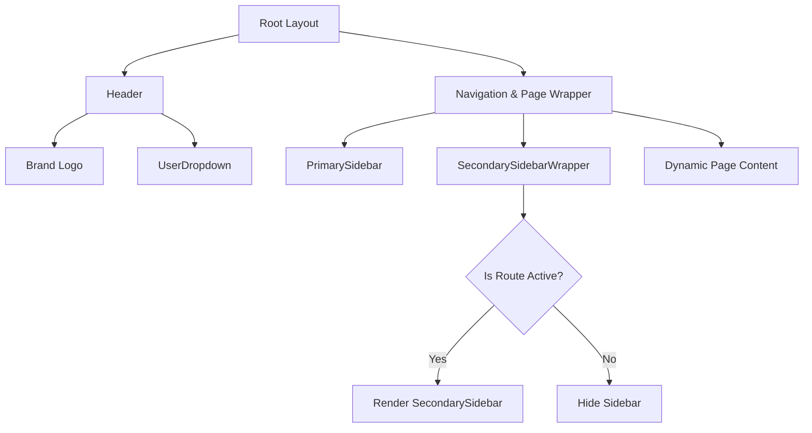

# Platinum RX Enterprise Suite - Shared Layout Navigation

A highly responsive, premium, and accessible double-sidebar layout dashboard built with **Next.js 16 (Turbopack)**, **Tailwind CSS v4**, and **Base UI** (@base-ui/react) + Shadcn design system.

---

## 🏗️ Architecture & Layout Coordination

The application implements a multi-tiered layout structure where sidebars coordinate dynamically based on the active route.



### 1. The Top Header
- Displays the brand logo (`Platinum RX Enterprise Suite`).
- Features the [UserDropdown](file:///c:/Users/ayush/Coding/NEXUSBatch/NEXUS/04_TS/shared_layout/components/user-dropdown.tsx) component on the right side.

### 2. Sidebars Coordination
- **PrimarySidebar ([PrimarySidebar.tsx](file:///c:/Users/ayush/Coding/NEXUSBatch/NEXUS/04_TS/shared_layout/app/components/PrimarySidebar.tsx))**:
  - Located on the far left. It displays high-level modules (e.g., Dashboard, Messages, Analytics, Tasks, Settings).
  - Determines the active state by reading the first path segment from `usePathname()` (e.g. `/messages/inbox` -> active state for `messages`).
- **SecondarySidebarWrapper ([SecondarySidebarWrapper.tsx](file:///c:/Users/ayush/Coding/NEXUSBatch/NEXUS/04_TS/shared_layout/app/components/SecondarySidebarWrapper.tsx))**:
  - Acts as a router listener. If the user is on the root path `/`, this sidebar is hidden.
  - When the path matches `/[primary]`, it fetches the sub-items for that module and mounts the **SecondarySidebar**.
- **SecondarySidebar ([SecondarySidebar.tsx](file:///c:/Users/ayush/Coding/NEXUSBatch/NEXUS/04_TS/shared_layout/app/components/SecondarySidebar.tsx))**:
  - Appears to the right of the Primary Sidebar.
  - Slugs option labels into URL path segments (e.g., "Analytics Hub" -> `/dashboard/analytics-hub`).
  - Features a close button `(X)` that resets navigation back to `/`.

### 3. Routing & Pages Hierarchy
The Next.js app directory structure supports this double-level routing out of the box:
- `/` -> Homepage ([page.tsx](file:///c:/Users/ayush/Coding/NEXUSBatch/NEXUS/04_TS/shared_layout/app/page.tsx)) - Shows welcome panels and tutorials.
- `/[primary]` -> Module Home Page ([app/[primary]/page.tsx](file:///c:/Users/ayush/Coding/NEXUSBatch/NEXUS/04_TS/shared_layout/app/%5Bprimary%5D/page.tsx)) - Renders context menu on the secondary sidebar and broad info of the primary route.
- `/[primary]/[sub]` -> Sub-item Detail Page ([app/[primary]/[sub]/page.tsx](file:///c:/Users/ayush/Coding/NEXUSBatch/NEXUS/04_TS/shared_layout/app/%5Bprimary%5D/%5Bsub%5D/page.tsx)) - Shows localized details and displays search queries if provided.

---

## 🛠️ Adding Shadcn & Base UI Components

This project utilizes **Base UI** (`@base-ui/react`) for accessible, headless components, combined with **Tailwind CSS v4** styling tokens. 

Here is how you can expand and add new UI components following the project's layout standard:

### Rules for Base UI Components

1. **Use `render` instead of `asChild`**
   Base UI components do not use Radix UI's `asChild` prop. Instead, they use the `render` prop to specify custom elements.
   *Example:*
   ```tsx
   import { Menu } from "@base-ui/react/menu";
   import Link from "next/link";

   // Correct way to render Next.js Link inside a Menu Item
   <Menu.Item render={<Link href="/profile" className="custom-style" />}>
     View Profile
   </Menu.Item>
   ```

2. **Component Nesting Contexts**
   Certain Base UI components have strict parent-child structure constraints. For example, any `Menu.GroupLabel` (or wrapper class) must always reside inside a `<Menu.Group>` or `<Menu.RadioGroup>` context to avoid runtime errors.
   *Example:*
   ```tsx
   <DropdownMenuGroup>
     <DropdownMenuLabel>Account Settings</DropdownMenuLabel>
   </DropdownMenuGroup>
   ```

### Standard Flow to Add a New UI Component

If you need to install a new Shadcn-styled component wrapper:
1. Locate or create the wrapper file under [components/ui/](file:///c:/Users/ayush/Coding/NEXUSBatch/NEXUS/04_TS/shared_layout/components/ui).
2. Import the headless primitives from `@base-ui/react`.
3. Construct the component wrapping it with Tailwind styles using `@/lib/utils`'s `cn` utility. Refer to [globals.css](file:///c:/Users/ayush/Coding/NEXUSBatch/NEXUS/04_TS/shared_layout/app/globals.css) for custom color/theme tokens (such as `--background`, `--accent`, `--border`, etc.).

---

## 🚀 Running and Validating the App

### Scripts
- **Start Development Server**:
  ```bash
  npm run dev
  ```
- **Type-Check and Production Build**:
  ```bash
  npm run build
  ```
- **Run ESLint Linter**:
  ```bash
  npm run lint
  ```
