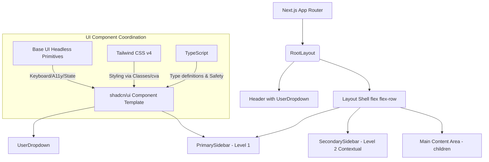

# Platinum RX Enterprise Suite — Frontend Architecture & Technical Documentation

Welcome to the comprehensive technical documentation and architecture guide for the **Platinum RX Enterprise Suite** frontend. 

This project is built using a modern, high-performance web development stack: **Next.js 16 (App Router)**, **React 19**, **TypeScript**, **Tailwind CSS v4**, **Base UI** (unstyled headless components), and **shadcn/ui** design patterns.

This guide provides an in-depth breakdown of the current implementation, routing mechanics, structural control flow, and a step-by-step roadmap for extending it with production-grade features like global theme switching, authentication tokens, cart state management, and order placement.

---

## Table of Contents
1. [Architecture & Technology Stack](#1-architecture--technology-stack)
   - [Next.js 16 & React 19 App Router](#nextjs-16--react-19-app-router)
   - [TypeScript Type Safety](#typescript-type-safety)
   - [Tailwind CSS v4 (Engine & Config)](#tailwind-css-v4-engine--config)
   - [Base UI + shadcn/ui Integration Model](#base-ui--shadcnui-integration-model)
2. [Project Directory Structure](#2-project-directory-structure)
3. [Control & Navigation Flow](#3-control--navigation-flow)
   - [Layout and Persistent Shell](#layout-and-persistent-shell)
   - [Two-Tier Dynamic Sidebar Routing](#two-tier-dynamic-sidebar-routing)
   - [Routing Parameter Extraction in Next.js 16](#routing-parameter-extraction-in-nextjs-16)
4. [Component-by-Component Source Code Analysis](#4-component-by-component-source-code-analysis)
   - [Root Layout (`app/layout.tsx`)](#root-layout-applayouttsx)
   - [Primary Sidebar (`app/components/PrimarySidebar.tsx`)](#primary-sidebar-appcomponentsprimarysidebartsx)
   - [Secondary Sidebar Wrapper & Sidebar](#secondary-sidebar-wrapper--sidebar)
   - [User Dropdown (`components/user-dropdown.tsx`)](#user-dropdown-componentsuser-dropdowntsx)
   - [Base UI Custom Primitives in `components/ui/`](#base-ui-custom-primitives-in-componentsui)
5. [Production-Grade Implementation Playbooks](#5-production-grade-implementation-playbooks)
   - [Global Theme Toggle Implementation](#global-theme-toggle-implementation)
   - [User details & Auth Token Management (JWT)](#user-details--auth-token-management-jwt)
   - [State Management: Cart Logic & Syncing](#state-management-cart-logic--syncing)
   - [Order Placement & Display Flow](#order-placement-display-flow)
   - [Side Drawers / Popovers for Cart & Orders](#side-drawers--popovers-for-cart--orders)

---

## 1. Architecture & Technology Stack



### Next.js 16 & React 19 App Router
This frontend is engineered around the **Next.js App Router**, which leverages React 19's capabilities (including Server Components by default, async routing parameters, and cleaner hook boundaries). 
- **Server Components (RSC)**: Layout pages or detail routes (e.g., `app/[primary]/page.tsx` and `app/[primary]/[sub]/page.tsx`) are Server Components. They render entirely on the server, minimizing the Javascript bundle sent to the client, accelerating initial paint, and improving SEO.
- **Client Components**: Interactive elements requiring hooks (like `usePathname` or user event listeners) are designated with the `"use client";` directive at the top of the file. Examples include the Sidebars and the Dropdown menu.
- **Persistent Layouts**: The layout shell does not unmount when switching pages, keeping the sidebars and headers active and preserving local client states.

### TypeScript Type Safety
TypeScript governs compile-time safety and self-documenting code across the application. It ensures:
- Strict typing of component props (e.g., `PrimarySidebarProps`, `SecondarySidebarProps`).
- Type verification for Next.js routing parameters (which are wrapped in Promises in newer Next.js releases, requiring async-await handling).
- Safe imports and code completion for component configuration mappings.

### Tailwind CSS v4 (Engine & Config)
The project utilizes **Tailwind CSS v4**, which simplifies configuration by moving custom utility variables and rules directly into the CSS file (`app/globals.css`) using CSS variables and `@theme` directives rather than relying on a heavy JavaScript-based `tailwind.config.ts`.
- **CSS Custom Properties**: The core theme properties (colors like `--background`, `--primary`, `--orange-primary`, shadows, and border radii) are defined inside `:root` and `.dark` blocks in `app/globals.css`.
- **Inline Theme Configuration**: Tailwind's `@theme inline` block maps these CSS variables directly to utility classes (e.g., `bg-primary`, `text-accent-foreground`, `rounded-lg`).
- **Zero-Build Custom Variants**: Custom media queries and dark mode variants are defined with `@custom-variant dark (&:is(.dark *));`.

### Base UI + shadcn/ui Integration Model
Unlike traditional shadcn setups that rely on Radix UI, this project adapts the **shadcn/ui** copy-paste pattern to work with **Base UI** (`@base-ui/react`), a headless, unstyled library from the creators of MUI.
1. **Base UI Primitives**: Base UI handles complex UI details: accessibility (ARIA attributes), focus management (focus loops, outline rings), state transitions (open/closed states), and keyboard events (Esc to close, Arrow keys to navigate menu items).
2. **shadcn/ui Concept**: Instead of hiding code in an npm library, components are written in `components/ui/` (e.g. `button.tsx`, `dropdown-menu.tsx`, `avatar.tsx`).
3. **Styling Integration**: Inside each component file, the Base UI primitive is imported, custom props are mapped, and Tailwind class strings are merged using `cn()` (which uses `clsx` and `tailwind-merge` to resolve styling conflicts).

---

## 2. Project Directory Structure

```
shared_layout/
├── app/                          # Next.js App Router Roots
│   ├── [primary]/                # Dynamic Route Group (Level 1 sidebar items)
│   │   ├── [sub]/                # Nested Dynamic Route Group (Level 2 sidebar items)
│   │   │   └── page.tsx          # Sub-menu detail page (Renders /:primary/:sub)
│   │   └── page.tsx              # Primary category landing page (Renders /:primary)
│   ├── components/               # Core Page Layout Components
│   │   ├── MainContent.tsx       # Content panel generator (used for local state testing)
│   │   ├── PrimarySidebar.tsx    # Left-most vertical navigation panel (Level 1)
│   │   ├── SecondarySidebar.tsx  # Dynamic sub-navigation contextual panel (Level 2)
│   │   └── SecondarySidebarWrapper.tsx # Route-aware controller for Level 2 Sidebar
│   ├── lib/
│   │   └── navigation.ts         # Navigation items and hierarchy configurations
│   ├── favicon.ico
│   ├── globals.css               # Main CSS containing Tailwind v4 settings & theme variables
│   ├── layout.tsx                # Application shell layout (Header, Sidebars, Main Content)
│   └── page.tsx                  # Home Route Landing Page (Renders /)
├── components/                   # Shared Global Reusable Components
│   ├── ui/                       # Tailwind-styled Base UI components (shadcn/ui style)
│   │   ├── avatar.tsx            # Avatar primitive styled with Tailwind
│   │   ├── button.tsx            # Button primitive mapping CVA styles
│   │   └── dropdown-menu.tsx     # Fully accessible menu primitive built with Base UI
│   └── user-dropdown.tsx         # Header profile menu component (Uses Avatar & DropdownMenu)
├── lib/
│   └── utils.ts                  # Tailwind utility helpers (clsx & twMerge wrapper)
├── components.json               # Config file tracking shadcn settings
├── eslint.config.mjs             # Linter rules
├── next.config.ts                # Next.js compiler preferences
├── package.json                  # Scripts and dependencies
├── postcss.config.mjs            # PostCSS configuration for styling processing
├── tailwind.config.ts            # Supplemental Tailwind settings
└── tsconfig.json                 # TypeScript compiler layout rules
```

---

## 3. Control & Navigation Flow

### Layout and Persistent Shell
When a user visits the application, the rendering starts at `app/layout.tsx` (the `RootLayout`). This component defines the structure of the entire browser viewport:

1. **Header**: Stays static at the top. Contains the logo and the `<UserDropdown />`.
2. **Inner Container**: Splitted into three columns:
   - **PrimarySidebar (Left Column)**: Static width (`w-64`), containing top-level application roots.
   - **SecondarySidebarWrapper (Middle Column)**: Conditional width (`w-72`), containing sub-sections for the active primary area.
   - **Main Panel (Right Column)**: Occupies the remaining space (`flex-1`). Renders the active page children (`{children}`).

### Two-Tier Dynamic Sidebar Routing
The primary sidebar and secondary sidebar coordinate dynamically using Next.js route segments:

```
User Click on Primary Item (e.g., "Messages")
  │
  ├─► Next.js router navigates path to "/messages"
  │
  ├─► layout.tsx triggers re-rendering of Client Components:
  │     ├─► PrimarySidebar detects current segment: "messages"
  │     │     └─► Applies active styling (orange highlight, left border indicator)
  │     │
  │     └─► SecondarySidebarWrapper detects current segment: "messages"
  │           ├─► Matches "messages" against SECONDARY_ITEMS_MAP: ["Inbox", "Sent", ...]
  │           ├─► Since segment is not null, displays <SecondarySidebar>
  │           └─► Animates slide-in-from-left
  │
  └─► Server renders app/[primary]/page.tsx -> Children viewport displays default category view.
```

If the user clicks on a sub-menu item like **Inbox**:
1. The URL updates to `/messages/inbox`.
2. The `SecondarySidebar` receives `currentSubItem = "inbox"` (derived from the second segment in `SecondarySidebarWrapper`).
3. It slugifies the menu labels and highlights the item matching the url segment.
4. Next.js matches the dynamic route `app/[primary]/[sub]/page.tsx`, rendering the sub-menu layout.

---

## 4. Component-by-Component Source Code Analysis

### Root Layout (`app/layout.tsx`)
This file wraps the entire web page. It injects global styles, registers fonts, and maintains the global HTML document structure.

*Key Snippet Analysis:*
```tsx
export default function RootLayout({ children }: { children: React.ReactNode }) {
  return (
    <html lang="en">
      <body className={inter.className}>
        <div className="flex h-screen flex-col bg-white">
          {/* Header element: Always takes up full width, height of 14 (3.5rem) */}
          <header className="flex items-center justify-between h-14 px-6 border-b border-gray-200 bg-white shadow-sm shrink-0">
            <div className="flex items-center gap-3">
              <span className="text-xl font-bold text-orange-600">Platinum RX</span>
              <span className="text-xs text-gray-400 hidden sm:inline">Enterprise Suite</span>
            </div>
            <UserDropdown />
          </header>
          {/* Main content layout shell */}
          <div className="flex flex-1 overflow-hidden">
            {/* Primary Sidebar (Fixed Left) */}
            <PrimarySidebar items={PRIMARY_ITEMS} />
            {/* Secondary Sidebar (Conditional Middle) */}
            <SecondarySidebarWrapper itemsMap={SECONDARY_ITEMS_MAP} />
            {/* Scrollable workspace viewport (Right) */}
            <main className="flex-1 overflow-y-auto text-gray-800">{children}</main>
          </div>
        </div>
      </body>
    </html>
  );
}
```
* **`flex h-screen flex-col`**: Creates a layout viewport matching the screen height, forcing the header to sit at the top and the columns below it to grow and consume the remaining height.
* **`flex flex-1 overflow-hidden`**: Prevents the outer application shell from scrolling. The children elements handle their own inner scroll containment (`overflow-y-auto`).

---

### Primary Sidebar (`app/components/PrimarySidebar.tsx`)
Renders the top-level main navigation links. It uses `usePathname` to identify the active path.

*Key Snippet Analysis:*
```tsx
const pathname = usePathname();
// Splits path and extracts segment 1. E.g., "/dashboard/overview" -> "dashboard"
const currentPrimary = pathname.split("/")[1] || null;
```
It renders a series of Next.js Link components:
```tsx
<Link
  href={`/${item.id}`}
  className={`
    w-full text-left px-4 py-2.5 rounded-lg transition-all duration-200
    flex items-center gap-3 text-gray-700 font-medium
    hover:bg-orange-50 hover:text-orange-600
    ${isActive
      ? "bg-orange-50 text-orange-600 border-l-4 border-orange-500"
      : "border-l-4 border-transparent"
    }
  `}
>
```
* **Routing Indicator**: The visual cue (orange left border `border-l-4 border-orange-500`) is bound to the route state. It provides instant visual alignment when the route changes.

---

### Secondary Sidebar Wrapper & Sidebar
`SecondarySidebarWrapper.tsx` acts as the conditional state manager for the secondary sidebar.

```tsx
const pathname = usePathname();
const segments = pathname.split("/").filter(Boolean);
const primary = segments[0] || null;
const sub = segments[1] || null;

// If the user is on "/", segments is empty. Return null to hide the sidebar completely.
if (!primary) return null;

const subItems = itemsMap[primary] || [];
```

`SecondarySidebar.tsx` renders the mapped items and handles slug translation:
```tsx
{subItems.map((subItem) => {
  // Regex transforms "Analytics Hub" -> "analytics-hub"
  const subSlug = subItem.toLowerCase().replace(/\s+/g, "-");
  const href = `/${primary}/${subSlug}`;
  const isActive = currentSubItem === subSlug;
  
  return (
    <li key={subItem}>
      <Link href={href} className={cn(
        "w-full text-left px-4 py-2.5 rounded-lg text-gray-600 text-sm font-medium",
        isActive ? "bg-orange-100 text-orange-700 font-semibold" : ""
      )}>
        {subItem}
      </Link>
    </li>
  );
})}
```
* **Close Button**: The close button redirects back to `/`. Clicking it unmounts the wrapper, returning the layout to a single-sidebar state.
* **Transition Animation**: The sidebar is styled with `animate-in slide-in-from-left duration-200`, creating a smooth sliding transition when mounting.

---

### User Dropdown (`components/user-dropdown.tsx`)
Integrates custom shadcn primitives to build a user context menu.

```tsx
export function UserDropdown() {
  const user = {
    name: "John Doe",
    email: "john@platinumrx.com",
    avatar: "/avatars/user.jpg",
  };
  
  const initials = user.name.split(" ").map((n) => n[0]).join("").toUpperCase();

  return (
    <DropdownMenu>
      <DropdownMenuTrigger className="flex items-center gap-2 outline-none focus:ring-2 focus:ring-orange-500 rounded-full">
        <Avatar className="h-8 w-8">
          <AvatarImage src={user.avatar} alt={user.name} />
          <AvatarFallback>{initials}</AvatarFallback>
        </Avatar>
        <span className="hidden md:inline text-sm font-medium text-gray-700">{user.name}</span>
      </DropdownMenuTrigger>

      <DropdownMenuContent className="w-56" align="end" sideOffset={8}>
        {/* Profile Card Label */}
        <DropdownMenuLabel>
          <div className="flex flex-col space-y-1">
            <p className="text-sm font-medium leading-none">{user.name}</p>
            <p className="text-xs text-muted-foreground">{user.email}</p>
          </div>
        </DropdownMenuLabel>
        <DropdownMenuSeparator />
        
        {/* Polymorphic Menu Item */}
        <DropdownMenuItem render={<Link href="/profile" className="cursor-pointer" />}>
          View Profile
        </DropdownMenuItem>
        
        <DropdownMenuItem onClick={() => alert("Logout...")} className="cursor-pointer">
          Log out
        </DropdownMenuItem>
      </DropdownMenuContent>
    </DropdownMenu>
  );
}
```
* **Polymorphism in Base UI Menu**: Note the prop `render={<Link href="/profile" />}` in `DropdownMenuItem`. This is a powerful feature of Base UI. Rather than nesting an `<a>` inside a `<li>` (which causes tag nesting and accessibility validation issues), Base UI clones and merges the HTML element directly into the Link element.

---

### Base UI Custom Primitives in `components/ui/`

#### Dropdown Menu (`components/ui/dropdown-menu.tsx`)
This custom component bridges Base UI's `@base-ui/react/menu` package with the local utility system.
```tsx
import { Menu as MenuPrimitive } from "@base-ui/react/menu"
```
It utilizes several sub-elements:
- **`MenuPrimitive.Root`**: Context provider tracking state (`open`, `activeItem`).
- **`MenuPrimitive.Portal`**: Renders the modal overlay directly onto the HTML body to prevent parent relative positioning overflow and clipping.
- **`MenuPrimitive.Positioner`**: Coordinates boundary alignment, collision behavior, and offset distances.
- **`MenuPrimitive.Popup`**: Renders the floating popup panel. Classes are assigned to animate transitions using HTML custom data-attributes:
  ```className={cn("data-open:animate-in data-open:fade-in-0 data-open:zoom-in-95 data-closed:animate-out ...") }```
  *Base UI automatically injects `data-open` and `data-closed` based on open states, which Tailwind maps to the appropriate transition properties.*

#### Avatar (`components/ui/avatar.tsx`)
Wraps `@base-ui/react/avatar` for resilient user-image loading.
- If the image fails to load or the path is broken, the component automatically catches the error and falls back to rendering initials without showing broken image icons.

#### Button (`components/ui/button.tsx`)
Constructs a flexible button structure based on `@base-ui/react/button`.
- Coordinates variant classes (`default`, `outline`, `destructive`) and sizing presets via Class Variance Authority (`cva`).

---

## 5. Production-Grade Implementation Playbooks

This section details step-by-step instructions and patterns for implementing the requested production features.

### Global Theme Toggle Implementation

To toggle themes globally (e.g., between Light and Dark mode) in a Next.js App Router context:

#### Step 1: Create a Theme Provider Context
Create a Client Component file: `app/components/theme-provider.tsx`.

```tsx
"use client";

import { createContext, useContext, useEffect, useState } from "react";

type Theme = "light" | "dark";

const ThemeContext = createContext<{
  theme: Theme;
  toggleTheme: () => void;
} | undefined>(undefined);

export function ThemeProvider({ children }: { children: React.ReactNode }) {
  const [theme, setTheme] = useState<Theme>("light");

  useEffect(() => {
    // Check local storage or system preference
    const savedTheme = localStorage.getItem("theme") as Theme;
    const systemPrefersDark = window.matchMedia("(prefers-color-scheme: dark)").matches;
    const initialTheme = savedTheme || (systemPrefersDark ? "dark" : "light");
    
    setTheme(initialTheme);
    document.documentElement.classList.toggle("dark", initialTheme === "dark");
  }, []);

  const toggleTheme = () => {
    const nextTheme = theme === "light" ? "dark" : "light";
    setTheme(nextTheme);
    localStorage.setItem("theme", nextTheme);
    document.documentElement.classList.toggle("dark", nextTheme === "dark");
  };

  return (
    <ThemeContext.Provider value={{ theme, toggleTheme }}>
      {children}
    </ThemeContext.Provider>
  );
}

export const useTheme = () => {
  const context = useContext(ThemeContext);
  if (!context) throw new Error("useTheme must be used within ThemeProvider");
  return context;
};
```

#### Step 2: Wrap the Root Layout
In `app/layout.tsx`, wrap the inner hierarchy within the provider:
```tsx
import { ThemeProvider } from "./components/theme-provider";

export default function RootLayout({ children }: { children: React.ReactNode }) {
  return (
    <html lang="en">
      <body>
        <ThemeProvider>
          <div className="flex h-screen flex-col bg-background text-foreground">
            {/* Header & Main shell */}
          </div>
        </ThemeProvider>
      </body>
    </html>
  );
}
```

#### Step 3: Implement Theme Switching Styles
* **Tailwind v4 Mapping**: The background changes automatically because the CSS classes point to CSS variables (e.g., `bg-background` which resolves to `oklch(1 0 0)` in light mode and `oklch(0.145 0 0)` in dark mode).
* Add a button in the header that invokes `toggleTheme()` from `useTheme()` to update the class list on the root document.

---

### User details & Auth Token Management (JWT)

For production authentication, we must manage user states and access tokens securely:

#### 1. Where to Store Tokens?
- **Access & Refresh Tokens**: Must be stored in **Secure, HTTP-only Cookies**. Do not store tokens in `localStorage` or `sessionStorage` as they are vulnerable to cross-site scripting (XSS) attacks.
- Setting cookies from server actions or backend frameworks:
  ```typescript
  // Example server-side set cookie (Next.js route handler / server action)
  import { cookies } from "next/headers";
  
  (await cookies()).set("session_token", token, {
    httpOnly: true,
    secure: process.env.NODE_ENV === "production",
    sameSite: "strict",
    maxAge: 60 * 60 * 24 * 7, // 1 week
    path: "/",
  });
  ```

#### 2. Where to Store User Metadata?
- Public metadata (e.g. Username, avatar, user preferences) is stored in a Client Component state store, such as **Zustand**, and populated during page load by querying a secure `/api/user` endpoint or passed directly from a parent Server Component layout.

#### 3. Flow chart of Authentication & Token Verification:
```
[Client App] ──(Request `/dashboard`)──► [Next.js Middleware]
                                                  │
                      ┌───────────────────────────┴──────────────────────────┐
                      ▼                                                      ▼
           [No Secure Cookie Found]                               [Secure Cookie Found]
                      │                                                      │
         Redirect to /login landing page                       Verify JWT signature / expiry
                                                                             │
                                                                   Pass request to page,
                                                              Fetch data using server-side headers
```

---

### State Management: Cart Logic & Syncing

For managing an e-commerce cart within React and Next.js, a local **Zustand store** with persistence is recommended.

#### Step 1: Create a Persistent Cart Store
Create `app/lib/cart-store.ts`:
```typescript
import { create } from "zustand";
import { persist } from "zustand/middleware";

export interface CartItem {
  id: string;
  name: string;
  price: number;
  quantity: number;
  imageUrl?: string;
}

interface CartState {
  cart: CartItem[];
  addItem: (item: Omit<CartItem, "quantity">) => void;
  removeItem: (id: string) => void;
  updateQuantity: (id: string, quantity: number) => void;
  clearCart: () => void;
}

export const useCartStore = create<CartState>()(
  persist(
    (set) => ({
      cart: [],
      addItem: (newItem) =>
        set((state) => {
          const existing = state.cart.find((i) => i.id === newItem.id);
          if (existing) {
            return {
              cart: state.cart.map((i) =>
                i.id === newItem.id ? { ...i, quantity: i.quantity + 1 } : i
              ),
            };
          }
          return { cart: [...state.cart, { ...newItem, quantity: 1 }] };
        }),
      removeItem: (id) =>
        set((state) => ({ cart: state.cart.filter((i) => i.id !== id) })),
      updateQuantity: (id, quantity) =>
        set((state) => ({
          cart: state.cart.map((i) => (i.id === id ? { ...i, quantity } : i)),
        })),
      clearCart: () => set({ cart: [] }),
    }),
    { name: "cart-storage" } // Persists automatically to localStorage
  )
);
```

#### Step 2: Synchronize with Server (Database)
1. For anonymous users, the cart is stored in `localStorage` via the Zustand store.
2. When a user logs in, trigger a synchronizing API call that merges the local client cart with the server database.
3. Keep database storage as the source of truth for logged-in sessions to ensure cross-device consistency.

---

### Order Placement & Display Flow

The order pipeline is designed to leverage React 19 actions for robust, validation-checked transactions.

```
[User Checkout Button]
         │
         ▼
[Validate Form Data] ──► (Zod verification for fields)
         │
         ▼
[Invoke Server Action] ──► Send cart details + delivery address to Next.js server
         │
         ▼
[Server Side Logic]
   ├─► Query Database: Check inventory & pricing integrity
   ├─► Generate Order entity in db (Status: PENDING)
   ├─► Generate Payment intent (e.g. Stripe checkout URL)
   └─► Send checkout redirect target back to client
         │
         ▼
[Payment Portal Redirect] ──► User completes checkout
         │
         ▼
[Payment Webhook Callback] ──► Updates database order state to SUCCESS
         │
         ▼
[Display Order Confirmation] ──► Revalidate React server Cache -> refresh client
```

#### Code Pattern: Server-Side Order Action
Create `app/lib/actions.ts`:
```typescript
"use server";

import { z } from "zod";
import { revalidatePath } from "next/cache";

const OrderSchema = z.object({
  address: z.string().min(10, "Address must be detailed"),
  items: z.array(z.object({
    id: z.string(),
    quantity: z.number().min(1),
  })),
});

export async function placeOrder(prevState: any, formData: FormData) {
  try {
    const rawItems = JSON.parse(formData.get("cartItems") as string);
    const validated = OrderSchema.safeParse({
      address: formData.get("address"),
      items: rawItems,
    });

    if (!validated.success) {
      return { success: false, error: validated.error.flatten().fieldErrors };
    }

    // Connect to database, decrement inventory, create transaction record.
    // E.g., await db.orders.create({ data: { ... } });

    revalidatePath("/orders"); // Invalidates cached order histories immediately
    return { success: true, orderId: "PRX-92841" };
  } catch (error) {
    return { success: false, error: "Database checkout failure" };
  }
}
```

---

### Side Drawers / Popovers for Cart & Orders

To display the shopping cart or order details drawer sliding out from the right side of the screen:

#### Step 1: Implement an accessible Dialog/Drawer using Base UI
We use the `@base-ui/react/dialog` library to build a focus-locked side drawer:

Create `components/ui/drawer.tsx`:
```tsx
"use client";

import * as React from "react";
import { Dialog as DialogPrimitive } from "@base-ui/react/dialog";
import { cn } from "@/lib/utils";

export function Drawer({ ...props }: DialogPrimitive.Root.Props) {
  return <DialogPrimitive.Root {...props} />;
}

export function DrawerTrigger({ ...props }: DialogPrimitive.Trigger.Props) {
  return <DialogPrimitive.Trigger {...props} />;
}

export function DrawerContent({
  children,
  className,
  ...props
}: DialogPrimitive.Popup.Props) {
  return (
    <DialogPrimitive.Portal>
      {/* Backdrop overlay */}
      <DialogPrimitive.Backdrop className="fixed inset-0 z-50 bg-black/40 backdrop-blur-sm transition-opacity duration-300 data-open:animate-in data-open:fade-in-0 data-closed:animate-out data-closed:fade-out-0" />
      
      {/* Drawer viewport positioning (Slide-out from Right side) */}
      <DialogPrimitive.Popup
        className={cn(
          "fixed top-0 right-0 z-50 h-full w-full max-w-md bg-white p-6 shadow-2xl outline-none flex flex-col",
          "transition-transform duration-300",
          "data-open:animate-in data-open:slide-in-from-right",
          "data-closed:animate-out data-closed:slide-out-to-right",
          className
        )}
        {...props}
      >
        {children}
      </DialogPrimitive.Popup>
    </DialogPrimitive.Portal>
  );
}

export function DrawerClose({ ...props }: DialogPrimitive.Close.Props) {
  return <DialogPrimitive.Close {...props} />;
}
```

#### Step 2: Use the Drawer in your Layout
Integrate it into the page header (e.g., beside the `UserDropdown` in `app/layout.tsx`):

```tsx
import { Drawer, DrawerTrigger, DrawerContent, DrawerClose } from "@/components/ui/drawer";
import { useCartStore } from "@/app/lib/cart-store";

export function CartDrawerTrigger() {
  const cart = useCartStore((state) => state.cart);
  const totalItems = cart.reduce((acc, item) => acc + item.quantity, 0);

  return (
    <Drawer>
      <DrawerTrigger className="relative p-2 text-gray-600 hover:text-orange-500 rounded-full hover:bg-gray-100">
        🛒
        {totalItems > 0 && (
          <span className="absolute -top-1 -right-1 bg-orange-600 text-white text-[10px] w-5 h-5 flex items-center justify-center rounded-full font-bold">
            {totalItems}
          </span>
        )}
      </DrawerTrigger>
      
      <DrawerContent>
        <div className="flex justify-between items-center border-b pb-4 mb-4">
          <h3 className="text-lg font-bold text-gray-800">Shopping Cart</h3>
          <DrawerClose className="text-gray-400 hover:text-gray-600">Close ✕</DrawerClose>
        </div>
        
        {/* Scrollable list of items */}
        <div className="flex-1 overflow-y-auto space-y-4">
          {cart.length === 0 ? (
            <p className="text-gray-500 text-center py-10">Your cart is empty.</p>
          ) : (
            cart.map((item) => (
              <div key={item.id} className="flex justify-between items-center border-b pb-2">
                <div>
                  <h4 className="font-semibold text-sm">{item.name}</h4>
                  <p className="text-xs text-gray-400">Qty: {item.quantity}</p>
                </div>
                <p className="font-medium text-sm">${item.price * item.quantity}</p>
              </div>
            ))
          )}
        </div>
        
        {/* Checkout Footer */}
        <div className="border-t pt-4 mt-4 space-y-4">
          <div className="flex justify-between font-semibold">
            <span>Total:</span>
            <span>
              ${cart.reduce((acc, item) => acc + item.price * item.quantity, 0)}
            </span>
          </div>
          <button className="w-full bg-orange-600 hover:bg-orange-700 text-white py-3 rounded-lg font-medium transition-colors">
            Proceed to Checkout
          </button>
        </div>
      </DrawerContent>
    </Drawer>
  );
}
```

---

## 6. How Next.js, Base UI, Tailwind, and TypeScript Coordinate

This project demonstrates a production-standard coordination pattern where each tool serves a specific role:

1. **Routing and Page State (Next.js)**: Governs which page is mounted on screen. Navigating page routes updates the client URL, allowing users to bookmark pages, deep-link into sub-sections, and refresh without losing their navigation context.
2. **Type Safety & Intellisense (TypeScript)**: Standardizes props structures and API payloads, ensuring that components like `PrimarySidebar` and `SecondarySidebar` consume objects with correct types.
3. **Interactive Control Loop & Accessibility (Base UI)**: Injects essential accessibility states (`aria-haspopup`, `aria-expanded`, focus trapping) without applying preset design properties. This makes the interface extremely flexible.
4. **Visual Design & Micro-animations (Tailwind CSS v4)**: References the active class attributes and custom properties of Base UI (like `data-open` or `data-closed`) to execute transitions and apply beautiful typography, shadows, borders, and layouts.
